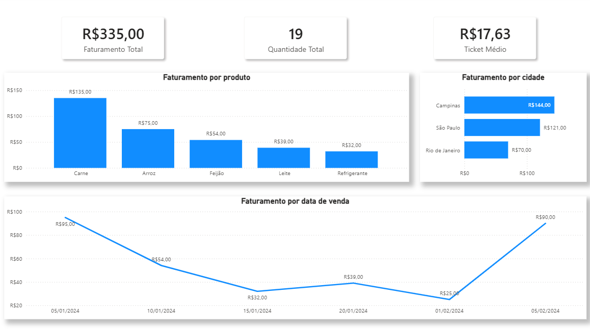
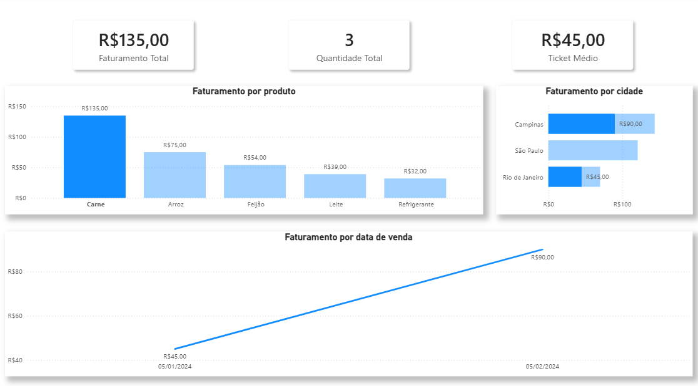
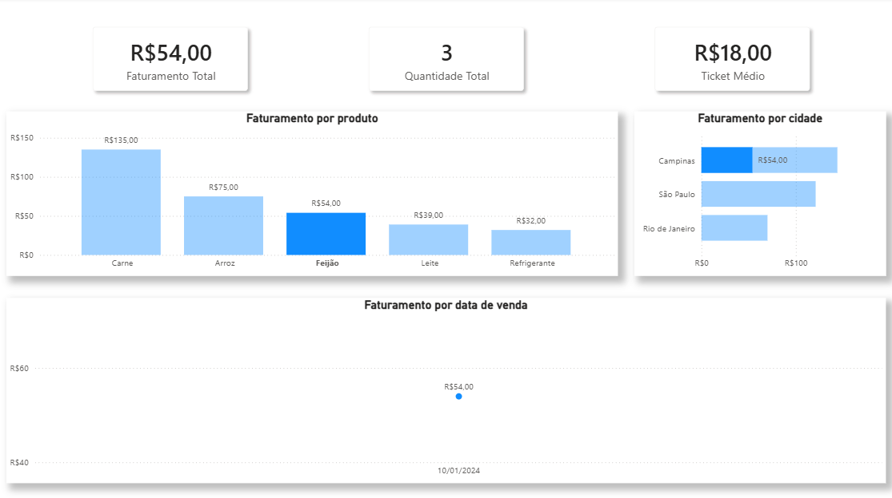
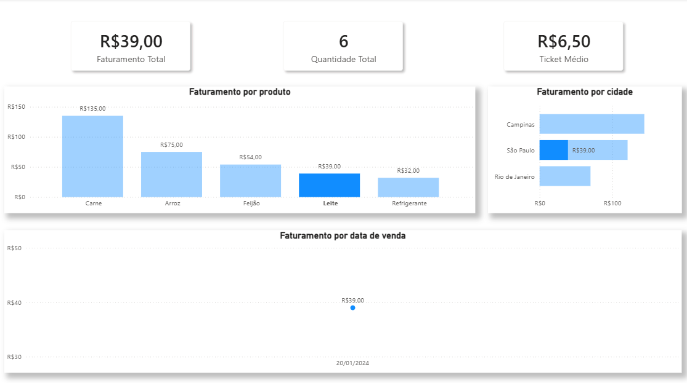
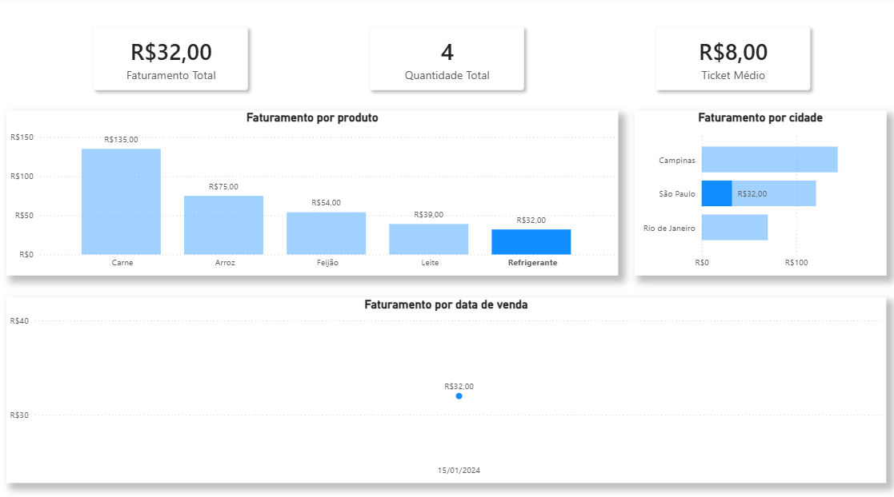
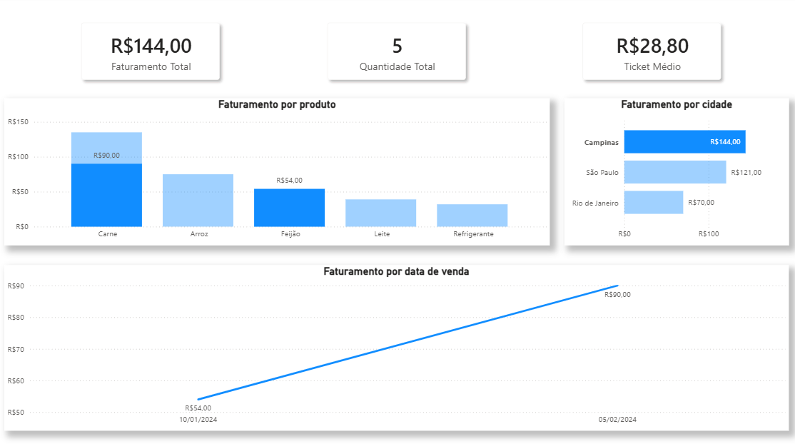
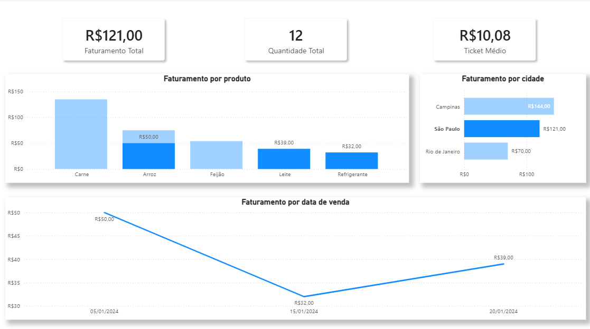
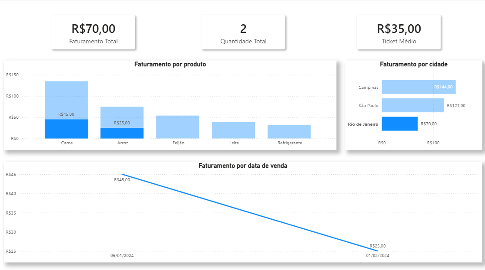

# 📊 Projeto de Análise de Vendas — MySQL, Pandas e Power BI

## 📌 Visão Geral

Este projeto simula um **cenário real de análise de dados empresarial**, indo desde a **criação do banco de dados** até a **construção de um dashboard analítico no Power BI**.

O objetivo é demonstrar, de forma prática, o fluxo comum em empresas:

> **Banco de Dados → SQL → Python → CSV → Power BI → Dashboard**

---

## 🛠️ Tecnologias Utilizadas

* **MySQL** — modelagem e consultas SQL
* **Python**

  * pandas
  * pymysql
* **Power BI**

  * Power Query
  * DAX
  * Visualização de dados

---

## 🗄️ Criação do Banco de Dados

```sql
CREATE DATABASE empresa_vendas;
USE empresa_vendas;
```

---

## 📦 Criação das Tabelas

### Tabela `produtos`

```sql
CREATE TABLE produtos (
    id INT PRIMARY KEY,
    nome_produto VARCHAR(50),
    categoria VARCHAR(30),
    preco DECIMAL(10,2)
);
```

### Tabela `clientes`

```sql
CREATE TABLE clientes (
    id INT PRIMARY KEY,
    nome VARCHAR(50),
    cidade VARCHAR(50)
);
```

### Tabela `vendas`

```sql
CREATE TABLE vendas (
    id_venda INT PRIMARY KEY,
    data_venda DATE,
    id_produto INT,
    id_cliente INT,
    quantidade INT,
    FOREIGN KEY (id_produto) REFERENCES produtos(id),
    FOREIGN KEY (id_cliente) REFERENCES clientes(id)
);
```

---

## 🧪 Dados Utilizados (Carga Inicial)

### Dados da tabela `produtos`

```sql
INSERT INTO produtos (id, nome_produto, categoria, preco) VALUES
(1, 'Arroz', 'Alimentos', 25.00),
(2, 'Feijão', 'Alimentos', 18.00),
(3, 'Carne', 'Açougue', 45.00),
(4, 'Leite', 'Bebidas', 6.50),
(5, 'Refrigerante', 'Bebidas', 8.00);
```

### Dados da tabela `clientes`

```sql
INSERT INTO clientes (id, nome, cidade) VALUES
(1, 'Ana', 'São Paulo'),
(2, 'Bruno', 'Rio de Janeiro'),
(3, 'Carlos', 'Campinas'),
(4, 'Daniela', 'São Paulo');
```

### Dados da tabela `vendas`

```sql
INSERT INTO vendas (id_venda, data_venda, id_produto, id_cliente, quantidade) VALUES
(1, '2024-01-05', 1, 1, 2),
(2, '2024-01-05', 3, 2, 1),
(3, '2024-01-10', 2, 3, 3),
(4, '2024-01-15', 5, 1, 4),
(5, '2024-01-20', 4, 4, 6),
(6, '2024-02-01', 1, 2, 1),
(7, '2024-02-05', 3, 3, 2);
```

---

## 🔎 Query Analítica Principal

```sql
SELECT 
    v.data_venda,
    p.nome_produto,
    p.categoria,
    c.cidade,
    v.quantidade,
    p.preco,
    v.quantidade * p.preco AS valor_total
FROM vendas v
INNER JOIN produtos p ON v.id_produto = p.id
INNER JOIN clientes c ON v.id_cliente = c.id;
```

Essa query gera uma **base analítica pronta para BI**, centralizando regras de negócio no SQL.

---

## 🐍 Extração de Dados com Python (Pandas)

```python
import pandas as pd
import pymysql

conexao = pymysql.connect(
    host='localhost',
    user='root',
    password='********',
    database='empresa_vendas'
)

query = """
SELECT v.data_venda, p.nome_produto, p.categoria, c.cidade,
       v.quantidade, p.preco, v.quantidade * p.preco AS valor_total
FROM vendas v
INNER JOIN produtos p ON v.id_produto = p.id
INNER JOIN clientes c ON v.id_cliente = c.id;
"""

df = pd.read_sql(query, conexao)

df.to_csv("base_analitica.csv", index=False)
```

O arquivo `base_analitica.csv` foi utilizado como fonte no Power BI.

---

## 📈 Power BI — Dashboard

### Medidas em DAX

* **Faturamento Total**

```DAX
Faturamento Total = SUM(base_analitica[valor_total])
```

* **Quantidade Total**

```DAX
Quantidade Total = SUM(base_analitica[quantidade])
```

* **Ticket Médio**

```DAX
Ticket Médio = 
DIVIDE(
    [Faturamento Total],
    [Quantidade Total]
)
```

---

## 📊 Dashboard



* Por produto:

  * Carne:
  
  * Arroz:
  
  * Feijão:
  
  * Leite:
  
  * Refrigerante:
  
* Por cidade:

  * Campinas:
  
  * São Paulo:
  
  * Rio de Janeiro:
  

---

## 🎯 Principais Insights

* **Carne** foi o produto com maior faturamento
* **Campinas** apresentou maior faturamento entre as cidades
* Variação clara de vendas ao longo do período analisado
